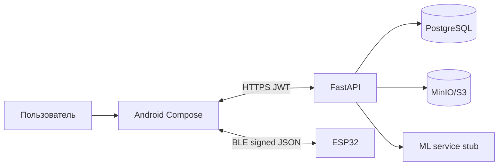
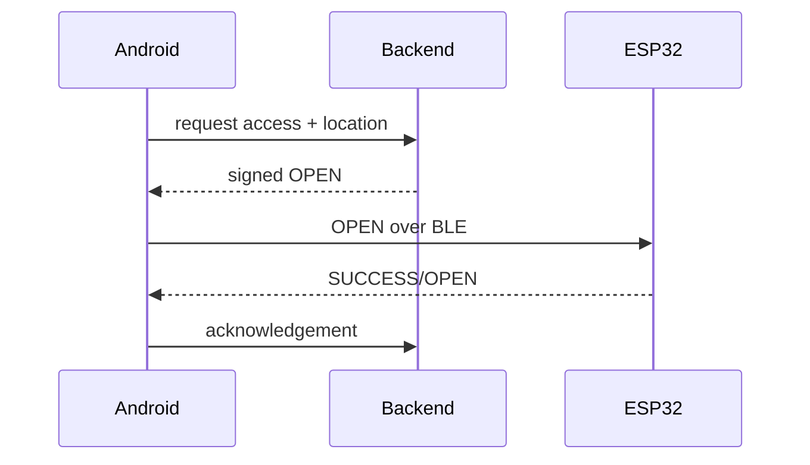
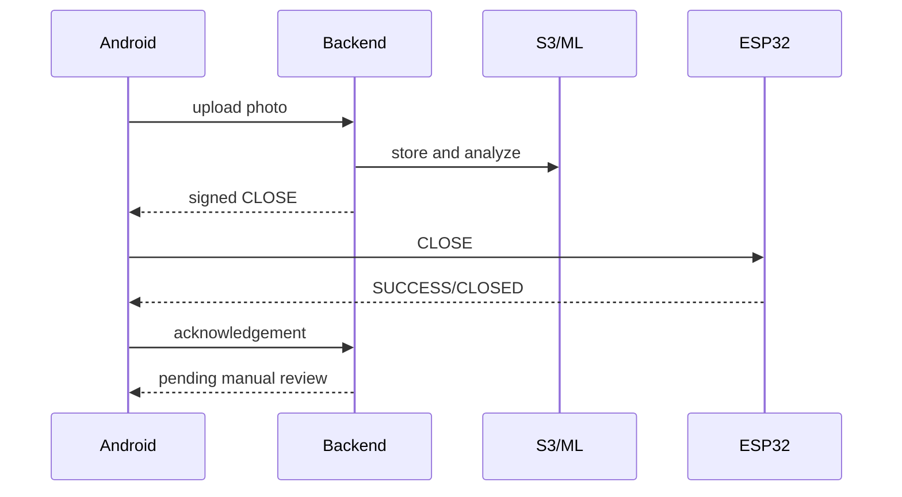
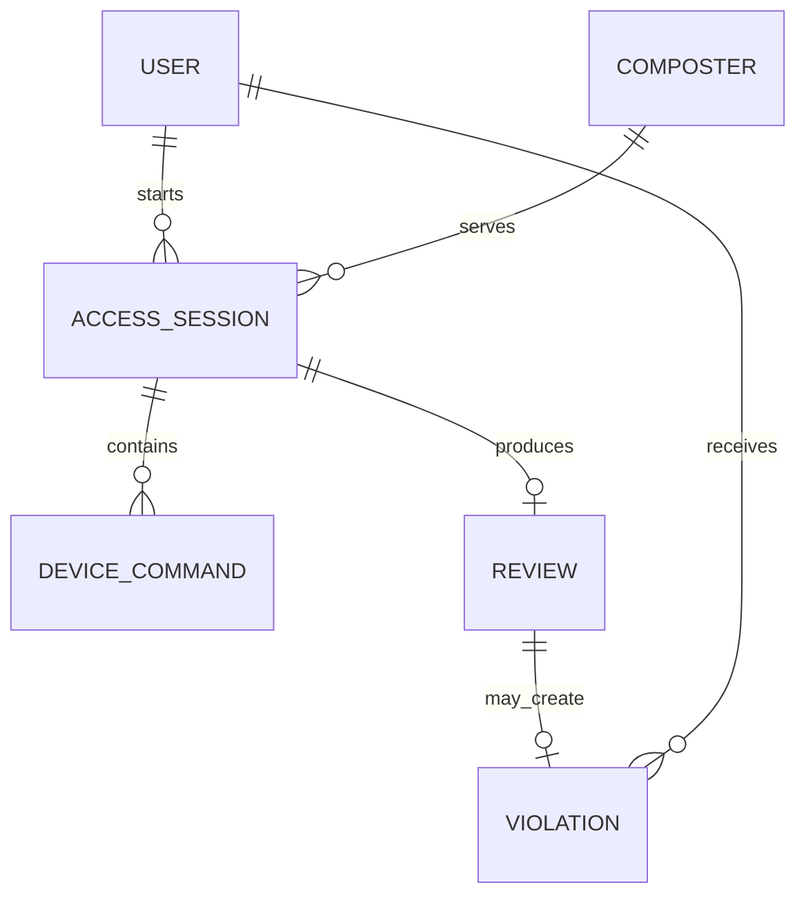
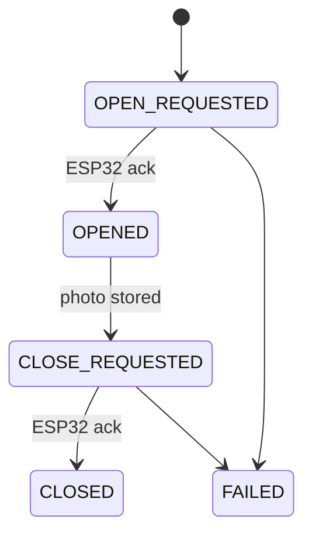

# Архитектура

```mermaid
flowchart LR
  U[Пользователь] --> A[Android Compose]
  A <-->|HTTPS JWT| API[FastAPI]
  A <-->|BLE signed JSON| E[ESP32]
  API --> P[(PostgreSQL)]
  API --> S[(MinIO/S3)]
  API --> M[ML service stub]
```

```mermaid
sequenceDiagram
  participant A as Android
  participant B as Backend
  participant E as ESP32
  A->>B: request access + location
  B-->>A: signed OPEN
  A->>E: OPEN over BLE
  E-->>A: SUCCESS/OPEN
  A->>B: acknowledgement
```

```mermaid
sequenceDiagram
  participant A as Android
  participant B as Backend
  participant S as S3/ML
  participant E as ESP32
  A->>B: upload photo
  B->>S: store and analyze
  B-->>A: signed CLOSE
  A->>E: CLOSE
  E-->>A: SUCCESS/CLOSED
  A->>B: acknowledgement
  B-->>A: pending manual review
```

```mermaid
erDiagram
  USER ||--o{ ACCESS_SESSION : starts
  COMPOSTER ||--o{ ACCESS_SESSION : serves
  ACCESS_SESSION ||--o{ DEVICE_COMMAND : contains
  ACCESS_SESSION ||--o| REVIEW : produces
  REVIEW ||--o| VIOLATION : may_create
  USER ||--o{ VIOLATION : receives
```

```mermaid
stateDiagram-v2
  [*] --> OPEN_REQUESTED
  OPEN_REQUESTED --> OPENED: ESP32 ack
  OPENED --> CLOSE_REQUESTED: photo stored
  CLOSE_REQUESTED --> CLOSED: ESP32 ack
  OPEN_REQUESTED --> FAILED
  CLOSE_REQUESTED --> FAILED
```

